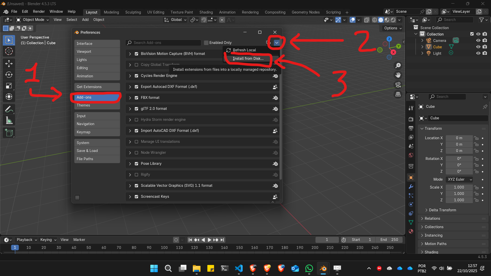
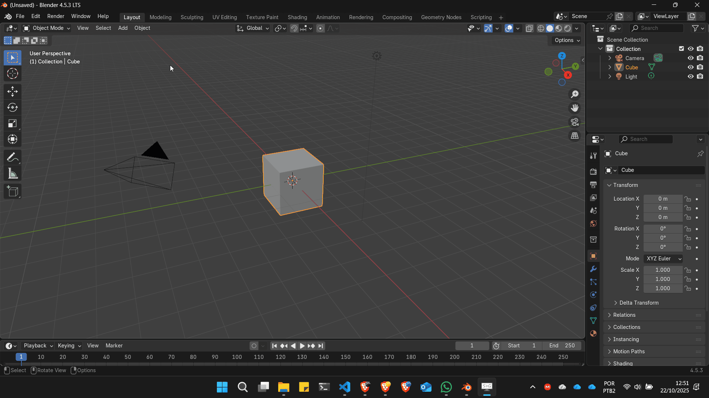

# Instalando o BlenderGis

## Baixando o add-on

Acesse o repositório do Github do [BlenderGis](https://github.com/domlysz/BlenderGIS)

<!--  -->

Procure pelos lançamentos (releases) e clique no link conforme indicado na imagem abaixo:


Baixe o último lançamento no formato compactado .zip


## Instalando

Baixe o arquivo .zip e, pela tela de ```Edit->Preferences->Get Extensions```, clique na seta de dropdown na direita da janela e escolha a opção  **Install From Disk**



O gif abaixo mostra o caminho para chegar na opção install from disk



O navegador de arquivos do Blender será aberto que que se selecione o arquivo ```.zip``` do add-on
<!--  -->

navegue até o local onde baixou o arquivo .zip, selecione o arquivo e aperte o botão **install from Disk**


<!--  -->

Dependendo da complexidade do Add-on a instalação pode ser muita rápida ou demorar um pouco. Aguarde. O Blender esta descompactando o arquivo .zip e copiando o conteúdo para a pasta de Add-ons da sua instalação. No caso do Windows 10, esta pasta fica no caminho:

```
C:\Users\<seu nome de usuário do windows>\AppData\Roaming\Blender Foundation\Blender\<número da versão do Blender instalada e.g. \4.5>\scripts\addons
```

Que também pode ser acessado digitando a lina abaixo na barra de endereço do **Explorador de Arquivos** do Windows (apenas mudando o número da versão do Blender):

```
%AppData%\Blender Foundation\Blender\<número da versão do Blender instalada e.g. \4.5>\scripts\addons
```

No fim desta execução, a **checkbox** aparecerá marcada e a instalação concluída. Alguns Add-ons, contudo, exigem configurações adicionais que aparecerão nesta mesma tela, assim que a **checkbox** aparecer como marcada.

## Configurações Adicionais do BlenderGis

No BlenderGis é necessário configurar uma pasta de cash e é recomendável adicionar o sistema de coordenadas geoespaciais mais utilizado na sua região.

### Cash Folder

Crie uma pasta para o cash do BlenderGis em algum lugar do seu drive e clique no ícone para definir o caminho, conforme figura abaixo:


Navegue até a pasta criada e clique no botã para aceitar.


### Sistema de Projeção Sirgas 2000 UTM 24s

O sistema de corrdenadas de referência Sirgas 2000 é o mais utilizado no Brasil. Informações sobre este sistema e seu código EPSG podem ser conferidas no [link](https://epsg.io/4674).

Na seção **spatial reference systems** das configurações do BlenderGis, clique no botão **Add**


Em seguida preencha a caixa de diálogo conforme indicado. 


```
EPSG:31984
SIRGAS 2000 UMT 24s
```

Para configurar qualquer outro sistema de coordenadas, pasta pesquisar o nome e o EPSG na internet e repetir as operações descritas acima.

## Vídeo com instruções de instalação e uso:

__________________________________
### Canal [Nicko16](https://www.youtube.com/channel/UCIldsycnma5sHR1VRP38vhg)

<iframe width="560" height="315" src="https://www.youtube.com/embed/YNtKnmRXVlo" frameborder="0" allow="accelerometer; autoplay; clipboard-write; encrypted-media; gyroscope; picture-in-picture" allowfullscreen></iframe>

__________________________________

## Mais sobre o BlenderGis

### [Modelagem de terrenos a partir de arquivos dxf](./blenderGis_dxf.md)