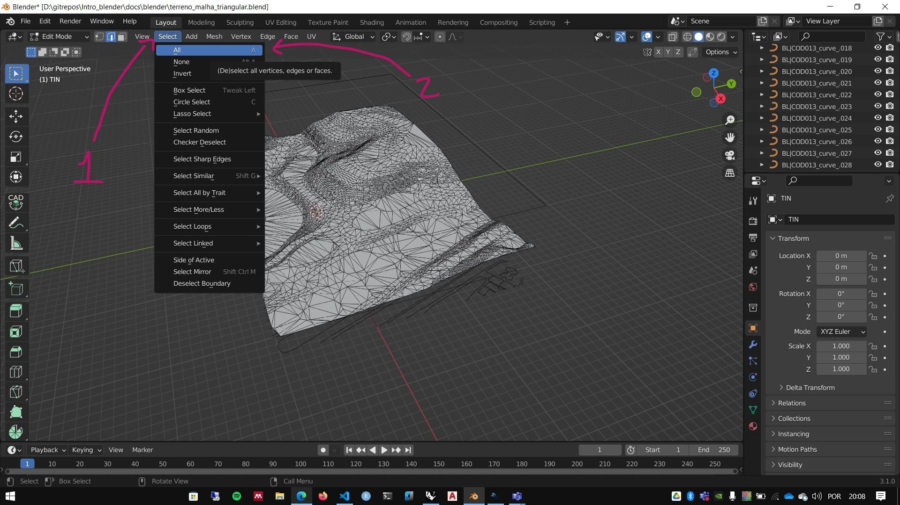
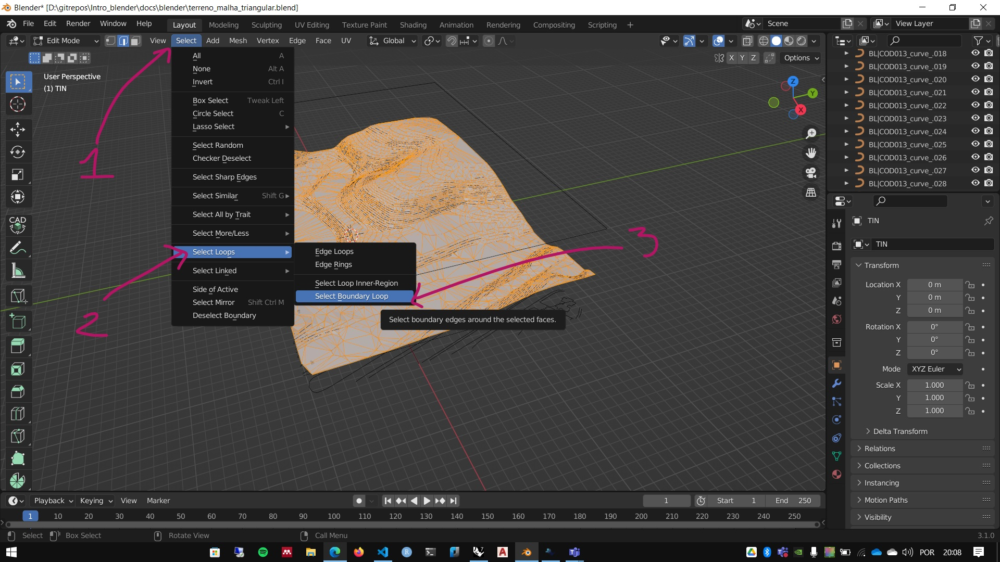
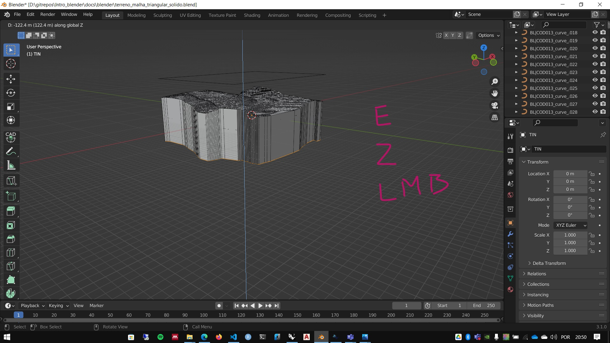

# Modelagem de terrenos a partir das curvas de nível com o BlenderGis

## [arquivo dxf com curvas de nível](../exemplos/terreno_mov_origem.dxf)

1. Baixe o arquivos acima.
1. Importe o arquivo DXF no Blender.
 
1. Em modelos muito grades, é recomendado aumentar o valor da variável **Menu N -> aba View -> Seção view -> end**. foi utilizado o valor 1000000 (um milhão de metros ou 100 km) neste exemplo.
 
2. Localize a(s) camada(s) onde estão as curvas de nível - As camadas(layers) de um arquivo dxf são importadas como objetos.
 
3. No arquivo baixado, as camadas 5 e 6 contém respectivamente as curvas de 5 em 5 metros e as curvas intermediárias.
4. Selecione os objetos 5_curves e 6_curves no Outliner e junte em um único obejto usando o atalho ctrl+j.
 
5. Renomeie (tecla F2)a nova camada para CURVAS DE NIVEL.
 
6. converta as curvas em Mesh.

 

Com as curvas convertidas em mesh, é possível exportar as coordenadas dos vértices para um arquivo ```.txt``` utilizando o código abaixo:

```Python
 import bpy
from pathlib import Path

# Get the directory of the current .blend file
blend_dir = Path(bpy.data.filepath).parent
save_to_file = blend_dir / "vertices.txt"  # Output file in the same folder
separator = " "  # Custom separator

# Extract vertex coordinates
vertices = [f"{v.co.x}{separator}{v.co.y}{v.co.z}" for v in bpy.context.object.data.vertices]

# Save to file
with open(save_to_file, 'w') as file:
    file.write('\n'.join(vertices))

print(f"Vertices exported to: {save_to_file}")   
 
```


1. No Menu do Plug-in BlenderGis, com a Mesh das curvas de nível selecionada, escolha a opção **Gis -> Mesh -> Delanay**.
 

1. Uma malha é gerada a partir das curvas
   

2. Mudando para o **Edit Mode** pode-se ver a malha triangular gerada pelo comando.
 

1. Para muitas operações é preciso transformar o terreno em um sólido.

2. No modo de edição, utilize a seleção de arestas ``2``.
   

   
3. Selecione todas as arestas ``a``.



4. Selecione as arestas que estão na borda da seleção.``Select`` -> ``Select Loops`` -> ``Select Boundary Loops``



5. Use o comando Extrude ``e`` com restrição para o eixo z ``z`` e arraste o mouse para baixo da superfície do terreno. A altura mínima do sólido deve ser suficiente para as operações booleanas de corte do terreno. Clique com o botão esquerdo do mouse para aceitar ``LMB``.


   
6. Ao menos que seu terreno tenha as bordas niveladas no eixo z, é preciso alinhar os segmentos. Use o comando Scale ``s``, restrinja para o eixo z ``z``, utilize o valor ``0``(zero) e clique com o botão esquerdo do mouse para aceitar ``LMB``.


7. Para fechar o sólido, com as arestas inferiores selecionadas, utilize o comando ``Vertex``->``New Edge/Faces from Vertex`` ou digitando o atalho ``f`` (as vezes esse comando é chamado de fuse).


 [arquivo terreno_malha_triangular.blend](./terreno_malha_triangular.blend)
