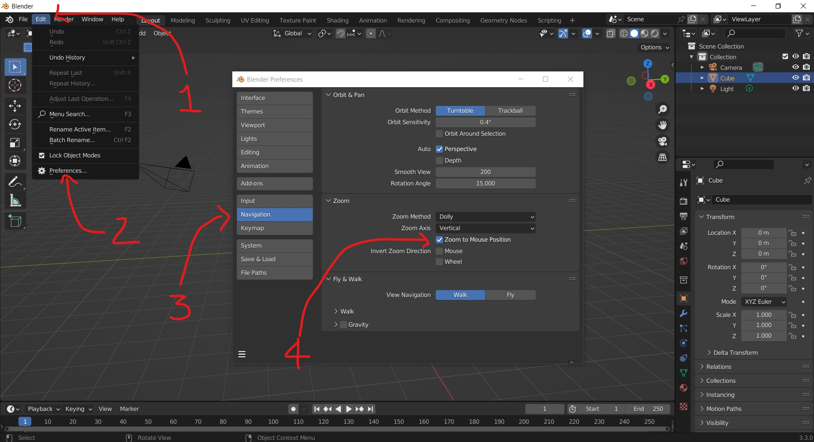

# Interface do Blender

[Documentação](https://docs.blender.org/manual/en/2.90/interface/index.html#user-interface)

1. Menu do programa (application menu)
2. Workspaces
3. Controles de cena e camadas de visibilidade (Scene and View Layer selection)
4. Editores

Abas servem para trocar entre diferentes configurações de editores.

________________
## Navegação

### Configuração modo de Zoom

________________
## Editores

[Documentação](https://docs.blender.org/manual/en/2.90/editors/index.html#editors)

  1. 3d viewport
  2. Outliner
     a. View Layer
  3. Properties
  4. Timeline

O atalho ``ctrl + space`` maximiza o editor atual ou retorna para a vista padrão da aba.

________________

## Painéis T e N

Alguns editores possuem pequenas setas nos lados de duas áreas. Menus podem ser abertos clicando e arrastando nas setas, ou pelos atalhos ``T`` e ``N``.

Abaixo Vemos a indicação das setas no editor 3d Viewport.

No Lado esquerdo, temos o painel de ferramentas (tools panel) que pode ser visto ou escondido teclando ``T``.

No lado direito temos o painel lateral (Sidebar panel), que pode ser mostrado ou recolhido também pela tecla ``N``(como muitos dos ajustes são numéricos, a equipe do Blender escolheu a tecla ``N`` como atalho para este painel)

É comum encontrar estes paineis referidos como ``T`` e ``N`` nos materiais de informação sobre o blender.

Uma outra versão do painel T pode ser vista pressionando as teclas ``shift + space``. 

Uma tabela com botões aparece na posição do ponteiro do mouse, apresentando os mesmos botões do painel de ferramentas. 

________________

## Modos de Trabalho do Editor 3D Viewport

Os modos de trabalho ([object modes](https://docs.blender.org/manual/en/2.90/editors/3dview/modes.html#object-modes) podem ser selecionados pela barra superior esquerda do editor 3d viewport.

Selecione um dos objetos da cena e clique na seta do seletor de modos como na figura acima.

Apenas dois modos de objeto serão apresentados neste momento, **Object Mode** e o **Edit Mode**. A tecla ``Tab`` alterna automaticamente entre estes dois modos.

**Observação:** note que, quando mudamos de modo os painéis mostram algumas opções diferentes.

_______________

## Precisão (snaps & pivots)

Comandos de precisão do Blender.

Pontos pivots de transformação do Blender.

_______________

## Sistemas de coordenadas

1. Global
2. Local
3. Normal
4. Gimbal
5. View
6. Cursor
7. A partir de um objeto (+)

________________

