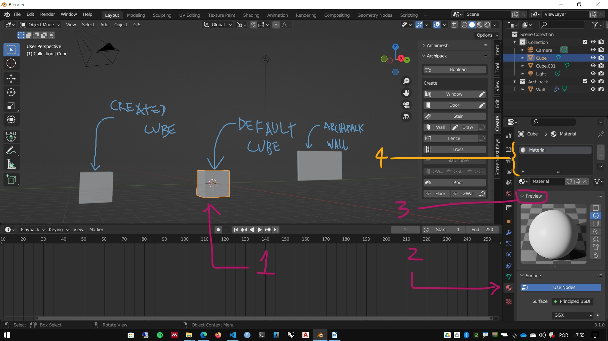
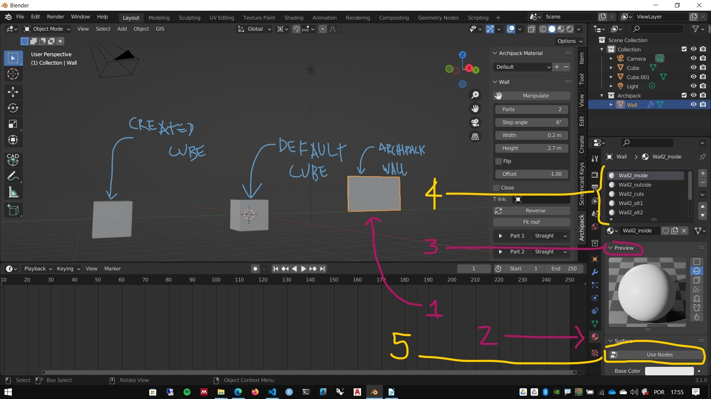
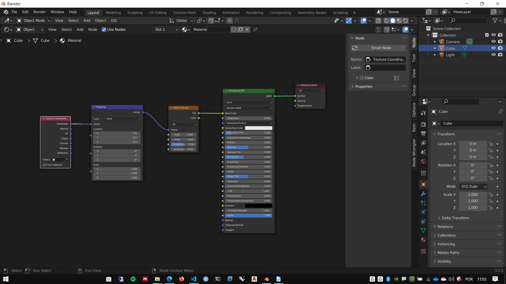
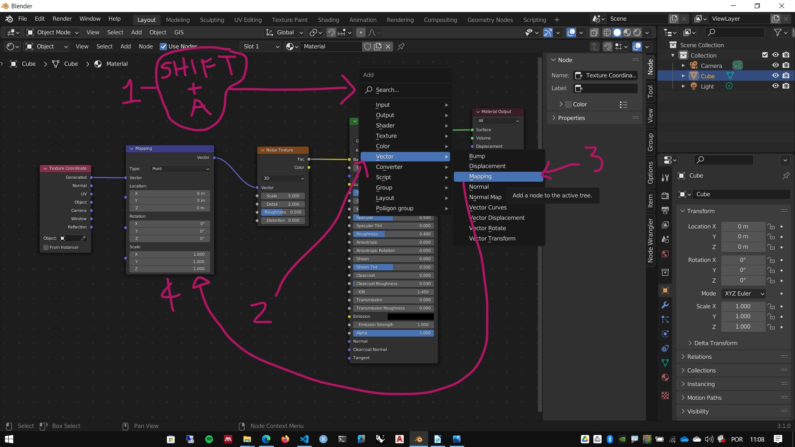

# Materiais, slots e Texturas

## Malhas, Slots e materiais

O Default Cube vem com um **slot** e um **material** aplicado na malha

Os elementos do **Archimesh** tem vários **slots** e vários **materiais** aplicados ao objeto. Mas a opção **use nodes** pode estar desativada.

Os objetos criados posteriormente não tem **slots criados nem materiais associados.

Apenas no edit mode podemos editar alguns aspectos das texturas

## Shading

### Node Wragler Addon

1. ``CTRL`` + ``T`` : coloca **Mapping** e **Texture Coordinates** na textura selecionada.
1. ``SHIFT`` + ``CTRL`` + ``T`` : Ajusta **Image Textures** ao **shader** selecionado.
2. ``SHIFT`` + ``P`` : Coloca um **frame** envolvendo os nós selecionados.
3. ``Shift`` + ``CTRL`` + ``LMB`` : Visualizar nó selecionado

### Shader editor

1. Output

2. Shaders

3. Textures

4. Textures transformations

5. Texture coordinates

#### Texturas procedurais do Blender

##### Conceito

#### Misturando cores, texturas e shaders

[exemplo texturas de tijolos procedural](./tests/material_tijolo.blend)

### Imagens como texturas texturas

1. Texturas a partir de imagens

[exemplo de texturas - Tijolos](./texture_bricks/Bricks077_2K-JPG.zip)

## World

### Sky texture

