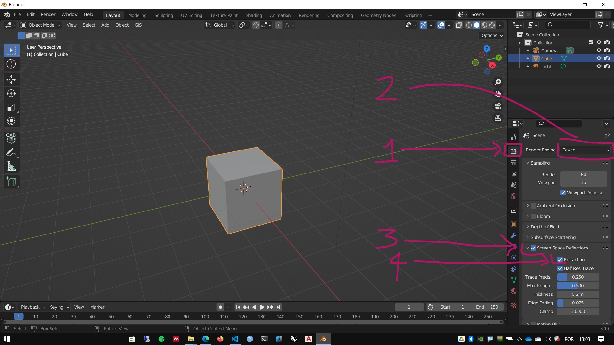
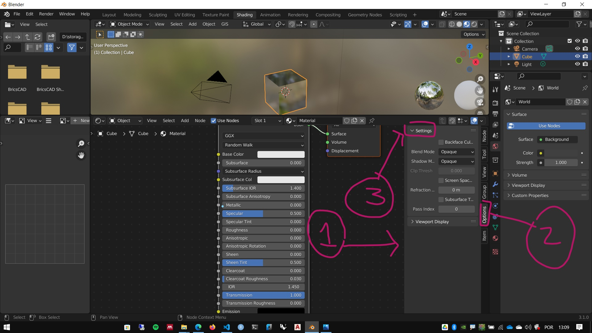
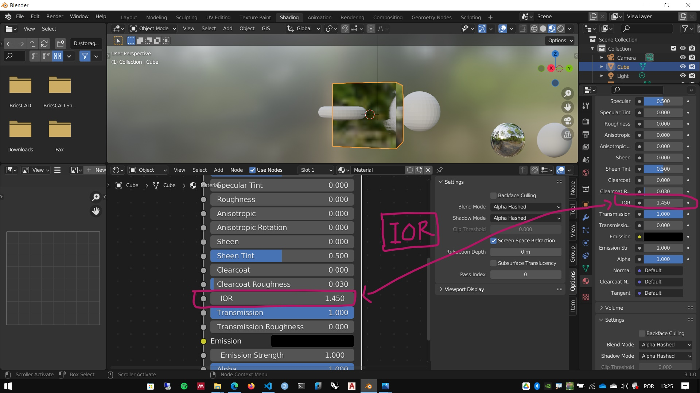

# Configurando transparência (vidro) no Evee

## Configurando o Evee

## Configurando o material

[Valores de referência de IOR](https://pixelandpoly.com/ior.html)

### Forma alternativa de configurar um material de vidro no Evee

[Arquivo com material](./glass/glass_test_evee.blend)

