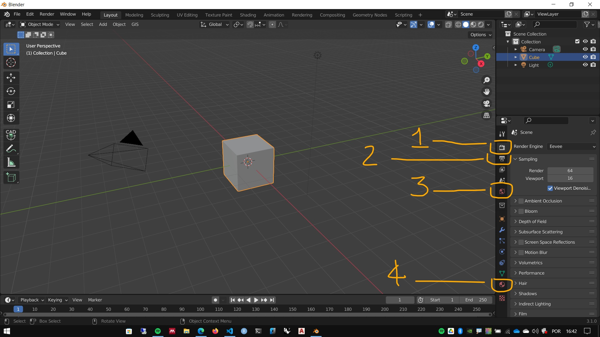

# Render

## Conceito

O render (Aportuguesado como Renderização) é a forma como os programas 3D geram visualizações e imagens.

Embora qualquer imagem gerada por um programa 3D (wireframe, sólidos, etc) seja tecnicamente um Render, o termo é mais empregado quando aplicado para visualizações foto realistas, contendo iluminação, materiais, texturas, transparências e outras propriedades que aproximam as imagens geradas de fotos de objetos reais.

## Menu de Render no Blender

O Menu de Render é mostrado na imagem abaixo. Para gerar um Render, basta apertar a tecla ``F12``. 

Contudo a imagem gerada será baseada na posição da câmera ativa

## Configurações

1. Configurações do motor de Render
2. Configurações gerais (para qualquer motor de Render)
3. Configurações do ambiente (World)
4. Configurações dos materiais

