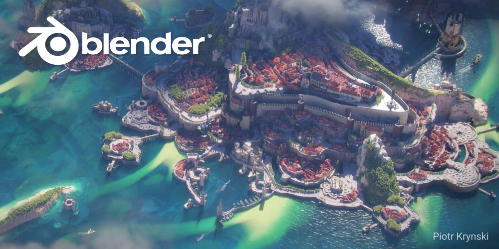

# Curso de Blender

<!--
- Apresentação do software e desmistificação da interface.
- Interface (Continuação).Configurações básicas Inserção de objetos. Tipos de Objetos. Sistemas de coordenadas,  menu N (side bar) e menu T.

- Menu T e edição de objetos do tipo Mesh. Diferença entre objeto e Mesh. Formas de copiar um objeto. Addons e snaps.

- Modificadores
- Modelagem Paramétrica e Geometry nodes. 
- BelnderGis e Modelagem de Terrenos.

 - Materiais, Slots, UVmap. Exercícios de UVunrap
- Texturas no properties, texturas no shader
- Materiais e texturas Exercício
- baixando blocos e texturas. Ajustando a cena para o render. Iluminação
- Render Image - configurações 
- Basico de animação pela timeline.  Animação de movimento de câmera - Render -->

## Curso Introdução à Modelagem

### Planejamento das Aulas:

* Aula 01 - Apresentação do software e desmistificação da interface.

* Aula 02 - Interface (Continuação).Configurações básicas Inserção de objetos. Tipos de Objetos. Sistemas de coordenadas,  menu N (sidebar) e menu T (tools).

* Aula 03 - Menu T e edição de objetos do tipo Mesh. Diferença entre objeto e Mesh. Formas de copiar um objeto. Addons e snaps.  Modelando a partir de um arquivo DXF.

* Aula 04 - Exercícios de modelagem

* Aula 05 - Modificadores (introdução) Modificadores booleanos. Modificador Solidify. Modificador Screw. Addons Para modelagem Arquitetônica (instalação e inserção de vãos e janelas). BelnderGis e Modelagem de Terrenos.

* Aula 06 - Exercícios de modelagem

* Aula 07 - Modelagem Paramétrica e Geometry nodes. 

* Aula 08 - Exercícios de modelagem

### Cronograma:

* 03/10 - 14h50 às 18:30 Aulas 1, 2

* 10/10  - 14h50 às 18:30 Aulas 3, 4

* 17/10  - 14h50 às 18:30 Aulas 5, 6

* 24/10  - 14h50 às 18:30 Aulas 7,8

        * total 16 horas aula

